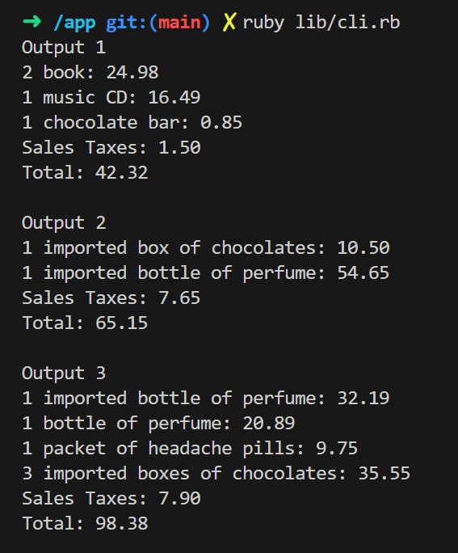

# SalesTaxes

## How to run

### Requirements:
ruby v3.2.2

### Command
Run
``` bash
ruby lib/cli.rb
```

Optionally you can pass other input files:

Run
``` bash
ruby lib/cli.rb input2.txt
```

Input file can be separated by "Input 2" tokens

## How to run specs

Bundle install rspec.

run: 
``` bash
rspec spec/ --format documentation
```

## How it was develop

- Using VSCODE DevContainer (dockerfile with ruby binary)
- Pry for debugging purposes
- Solargraph + rubylsp for vscode ruby integration

## Images:



